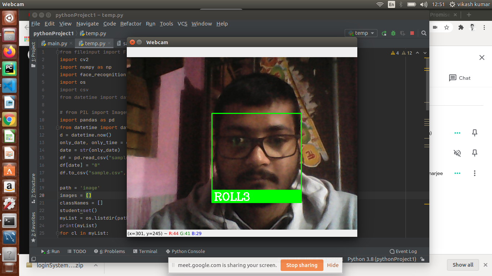

# Face-detection-and-attendance-management-system-
Attendance management system using face detection 

In these project we are using python,opencv,numpy library,dlib library,and face detection trained model,and student can access their data using website having login ,register and logout functionality

following steps used to complete this project which is used by model to predict the more accurate result:
1) Encode a picture using the HOG algorithm to create a simplified version of the image. 
   Using this simplified image, find the part of the image that most looks like a generic HOG encoding of a face.

2) Figure out the pose of the face by finding the main landmarks in the face.
   Once we find those landmarks, use them to warp the image so that the eyes and mouth are centered.

3) Pass the centered face image through a neural network that knows how to measure features of the face. Save those 128 measurements.

4) Looking at all the faces we’ve measured in the past, see which person has the closest measurements to our face’s measurements. That’s our match!

** for better understanding of alogrithm used you can refer this blog:- https://medium.com/@ageitgey/machine-learning-is-fun-part-4-modern-face-recognition-with-deep-learning-c3cffc121d78

here are some screenshot of project

